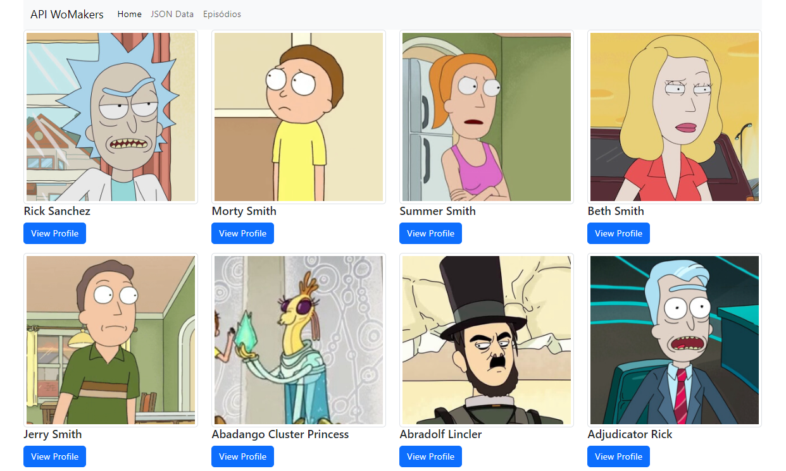
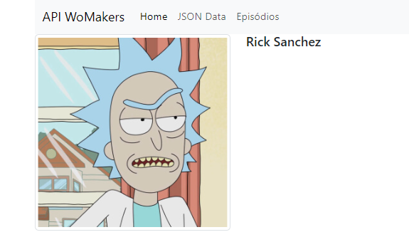

# Rick and Morty Characters Web App

This project is a simple web application built using **Flask** and **HTML** to display a list of characters from the Rick and Morty API. The application features pages for listing characters, viewing individual character profiles, and episodes.

## Features

- Display a list of characters with their names and images.
- View detailed profiles for individual characters.
- View episode information (placeholder page).
- Responsive design using Bootstrap 5.

## Technologies Used

- **Python (Flask)**: Backend framework for serving the web application.
- **HTML**: Templating language for rendering dynamic content.
- **Bootstrap 5**: Frontend framework for styling and responsive design.
- **Rick and Morty API**: External API used to fetch character data.

## How to Run the Project

1. **Clone the repository** to your local machine:
   ```bash
   git clone https://github.com/marina6coneto/rick-and-morty-app.git
   ```
   
2. **Navigate to the project directory**:
   ```bash
   cd rick-and-morty-app
   ```

3. **Create a virtual environment** (optional but recommended):
   ```bash
   python -m venv venv
   source venv/bin/activate  # On Windows: venv\Scripts\activate
   ```

4. **Install the dependencies**:
   ```bash
   pip install -r requirements.txt
   ```

5. **Run the Flask application**:
   ```bash
   flask run
   ```

6. **Open your browser** and go to `http://127.0.0.1:5000` to view the application.

## Application Pages

### Home Page - Characters List
The home page displays a list of characters fetched from the Rick and Morty API. Each character has an image, name, and a link to view their profile.



### Character Profile Page
The profile page displays detailed information about the selected character, including their image and name.




## Project Structure

```
rick-and-morty-app/
│
├── app.py                # Main application file
├── templates/            # HTML templates for Flask
│   ├── layout.html       # Base layout
│   ├── nav.html          # Navigation bar
│   ├── characters.html   # Character list page
│   ├── profile.html      # Character profile page
│   └── episodes.html     # Episodes page

```

---

Feel free to add more content or modify the application as you wish!
